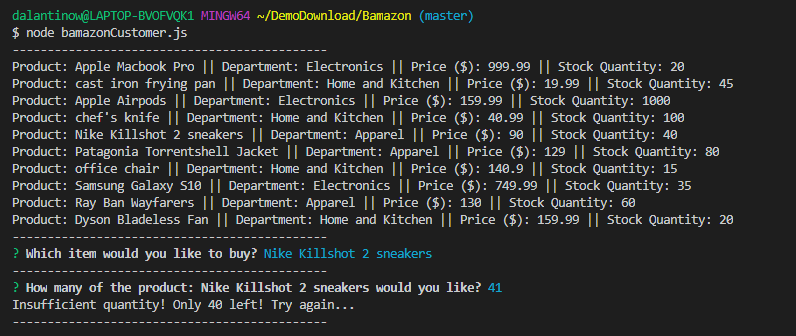

# Bamazon

### Overview

This application is a psuedo-storefront that takes in orders from a customer using the npm package Inquirer and depletes stock from the inventory of a MySQL schema.

### How to use

1. Before opening the ```bamazonCustomer.js``` file in your terminal, you need to install both the Inquirer and MySQL npm packages using ```npm install```.

2. You are then prompted with a table of items and a question as to which item you would like to purchase.

3. ```node bamazonCustomer.js```


4.  When you choose an item, the next question is for how many of the item you'd like to purchase, which checks the inventory for sufficient quantity then returns a total cost of the order.

5. 

## If insufficient quantity




